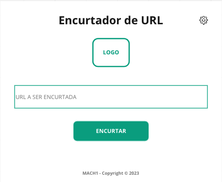
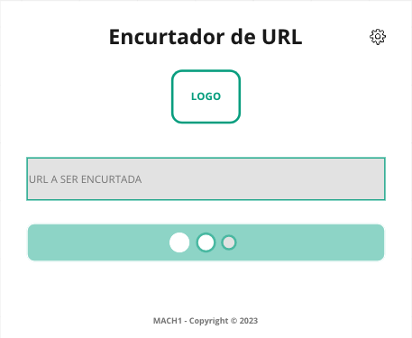
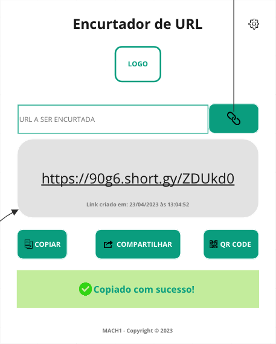
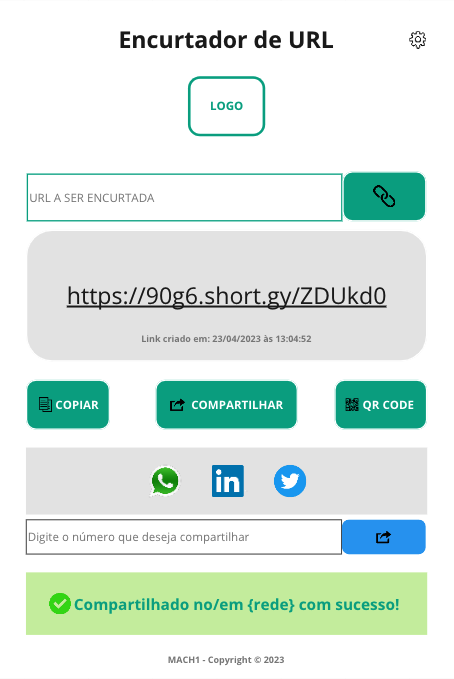
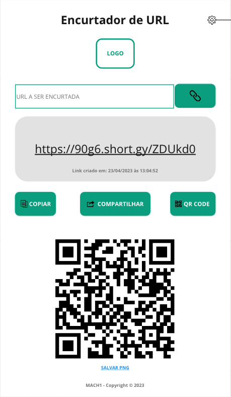
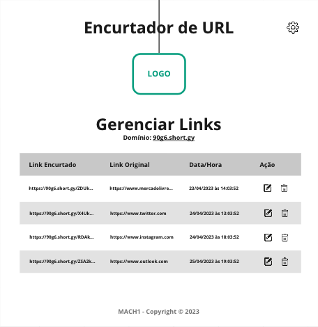
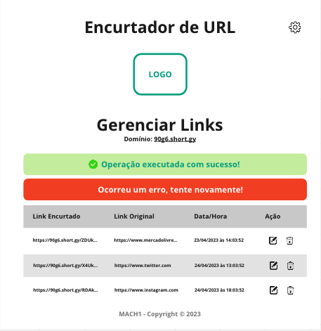
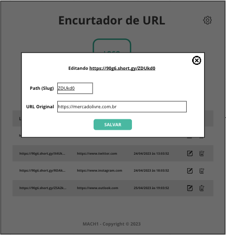
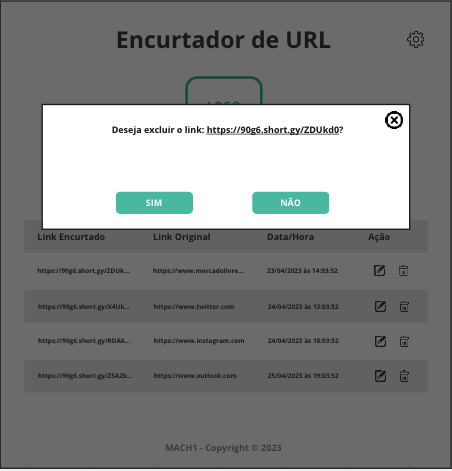

# Projeto - Encurtador de URL
## Sobre o projeto

Criação de Encurtador de URL baseado na API short.io

Projeto utiliza a API: [API short.io](https://app.short.io/settings/integrations/api-key)
### Especificações funcionais:
* Utilizar com maestria o HTML, CSS e JavaScript (import e export)
* Layout responsivo (mobile)
* Utilizar o fetch API para fazer as requisições
* Trabalhar as mensagens de erro no catch
* Pode usar o async, await
* Trabalhar uma mensagem e/ou img de carregando nas páginas onde tenha requisição, é muito importante, isso vale para as ações dos botões também (Ex.: clicou, mudar o layout do botão e desabilitar sua ação até obter a resposta ele voltar para o estado "normal").
* Atenção para todas as telas tem mensagens que são importantes
* Atenção para analisar como armazenar alguns dados frequentemente usados como:
* **iDomain**, **idString**, **hostname**

## Telas:

### Tela Inicial



### Carregando



### Resultado - Copiar



### Resultado - Compartilhar



### Resultado QR Code



### Lista de Links Cadastrados



### Lista de Links Mensagens



### Lista de Links Editar



### Lista de Links Excluir




# Crie sua conta e obtenha sua api key, ao ulitilar o código

* [short.io](https://short.io/pt)

* Para isso crie um arquivo chamado: **config.json**
* E adicione o seguinte:

```json
    {
	    "apiKey": "sua_api_key",
	    "domainId": "seu_id_domain"
    }
```
